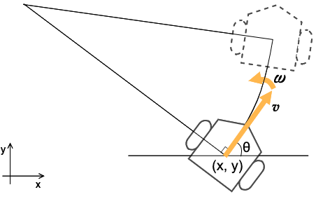
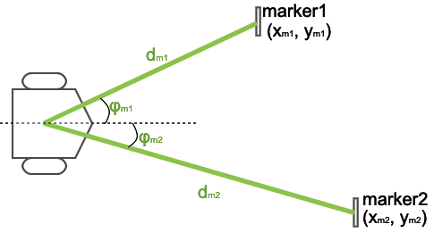
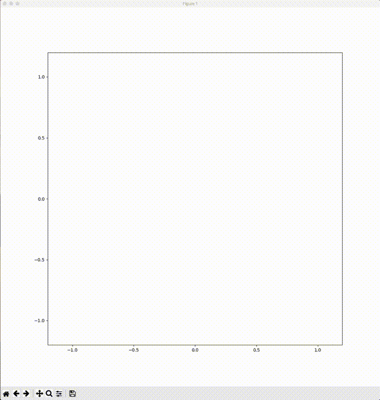
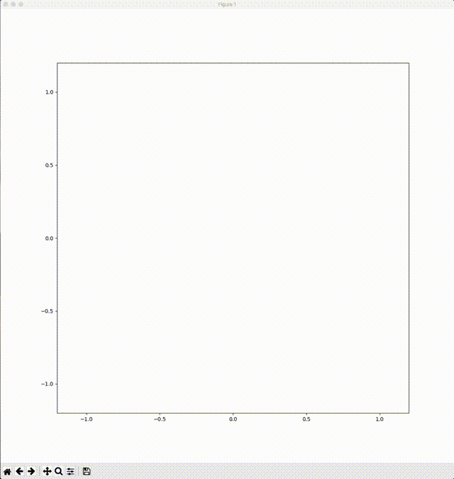

# robot\_simulator
A simulator of an autonomous mobile robot which estimates its pose by using Extended Kalman Filter and calculates control input by using Dynamic Window Approach.

## description
This program simulates an differential-drive wheeled autonomous robot like below:

* the state of robot: (x, y, θ)
* the control inputs: (v, ω) v=linear velocity, ω=angular velocity



This robot equips a 360-degree camera, and it can observe the distance and angle to the marker on environments.



## simulation
### circular route
This robot chases a target which moves on a circle.

* target: black object and black line
* actual trajectory: blue line
* observed mark: green lines
* estimated pose: red object
* estimated trajectory: red line



### square route
This robot chases a target which moves on a square.

* target: black object and black line
* actual trajectory: blue line
* observed mark: green lines
* estimated pose: red object
* estimated trajectory: red line



## how to use (on macOS Catalina)
1. install tcl-tk

    ```
    brew install tcl-tk
    ```
1. install python 3.9 with tcl-tk by pyenv

    ```
    env \
    PATH="$(brew --prefix tcl-tk)/bin:$PATH" \
    LDFLAGS="-L$(brew --prefix tcl-tk)/lib" \
    CPPFLAGS="-I$(brew --prefix tcl-tk)/include" \
    PKG_CONFIG_PATH="$(brew --prefix tcl-tk)/lib/pkgconfig" \
    CFLAGS="-I$(brew --prefix tcl-tk)/include" \
    PYTHON_CONFIGURE_OPTS="--with-tcltk-includes='-I$(brew --prefix tcl-tk)/include' --with-tcltk-libs='-L$(brew --prefix tcl-tk)/lib -ltcl8.6 -ltk8.6'" \
    pyenv install 3.9.5
    ```
1. install libraries

    ```
    pipenv install

    ```
1. start plotter (on terminal 1)

    ```
    pipenv run plotter
    ```
1. start agent (circular or square)

    ```
    pipenv run circular_agnet
    ```

    or

    ```
    pipenv run square_agent
    ```

## background
### state-space model
* [state-space\_model.md](docs/state-space_model.md)

### pose estimation using EKF
* [ekf.md](docs/ekf.md)

### local path planning
* [local\_path\_planning.md](docs/local_path_planning.md)

## license
[BSD 3-Clause License](./LICENSE)

## copyright
Copyright (c) 2021, [Nobuyuki Matsui](mailto:nobuyuki.matsui@gmail.com)

